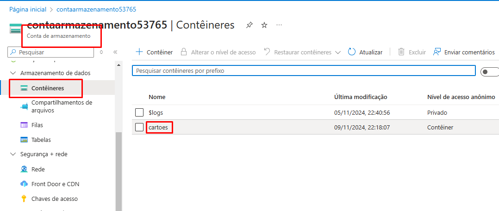
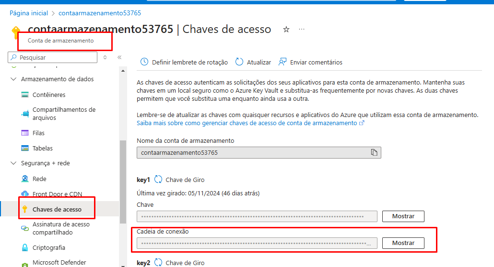
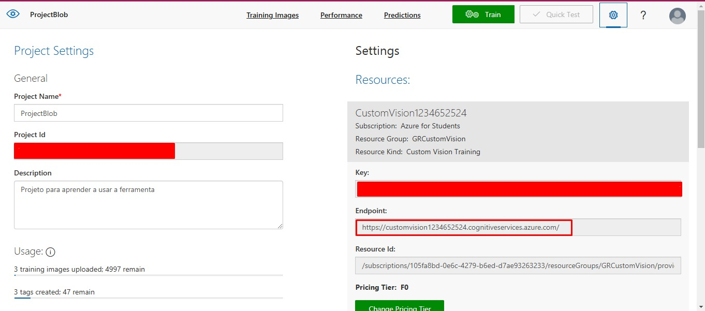
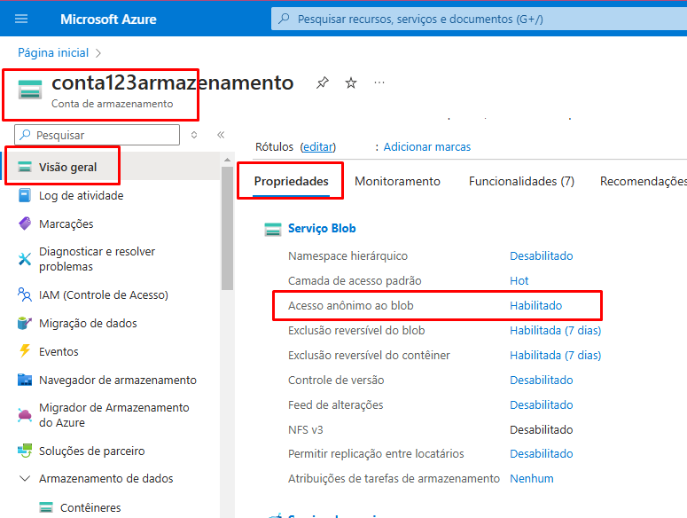
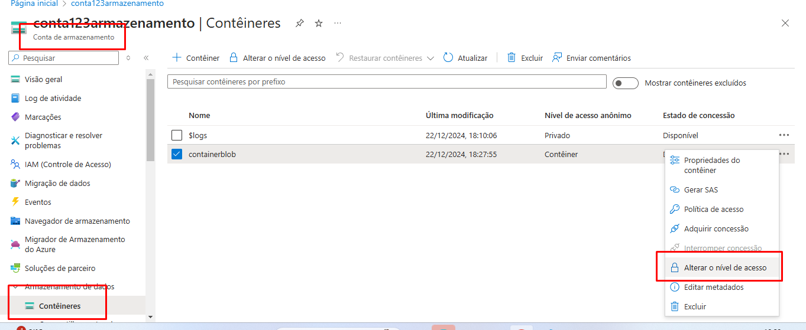

# Upload de Arquivos e Detecção de Cartão de Crédito com Azure

Este projeto permite o upload de imagens para o Azure Blob Storage, onde são processadas para o Custom Vision. A interface é construída com **Streamlit** para facilitar a interação com o usuário.

## Funcionalidades

- **Upload de Imagens**: Permite o upload de arquivos de imagem (formatos: PNG, JPG, JPEG) para o Azure Blob Storage.
- **Enviar imagens com Tag para o Custom Vision**
- **Interface Intuitiva**: Exibe as informações sobre o envio da imagem

## Requisitos do Azure

Para rodar o projeto, é necessário configurar os seguintes serviços no Azure:

- **Conta de Armazenamento e Contêiner**: Usado para armazenamento das imagens carregadas.
- **Projeto no Constom Vision**


## Como Utilizar

### 1. Clone o Repositório

```bash
git clone <URL_DO_REPOSITORIO>
cd <NOME_DO_REPOSITORIO>

### 2. Renomear o .env copy para ".env" e preencher os dados

## Onde obter os dados:

- CONTAINER_NAME

- AZURE_STOREGE_CONNECTION_STRING: 

- ENDPOINT, TRAINING_KEY e PROJECT_ID: 



## Permissões necessárias:

- A conta de armazenamento deve ter "acesso anonimo ao blob" habilitado


- Container deve estar com o nivel de acesso "Container (anonimo)"


### 3. Adicionar os requirements

- pip install -r requirements.txt

### 4. Alterar a TAG no "custon_vision.py"
 -TAG_NAME = "Alterar aqui pelo nome da teg desejada" 
 
### 5. Rodar o programa

- Abrir no terminal a pasta src e utilizar `streamlit run .\app.py`


